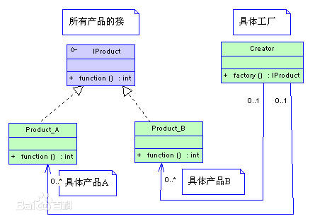
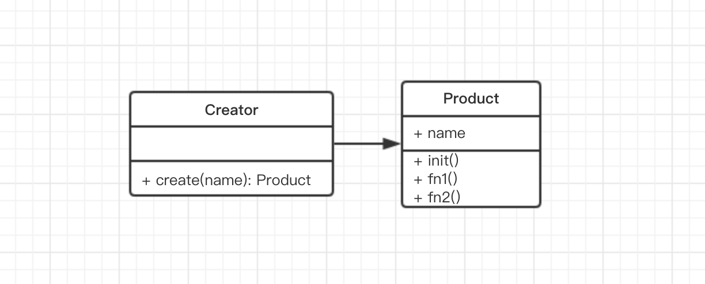

# 工厂模式 介绍

## 概念

工厂模式是我们最常用的实例化对象模式了，是用工厂方法代替`new`操作的一种模式。著名的 Jive 论坛 ,就大量使用了工厂模式，工厂模式在 Java 程序系统可以说是随处可见。因为工厂模式就相当于创建实例对象的`new`，我们经常要根据类`Class`生成实例对象，如`A a=new A()` 工厂模式也是用来创建实例对象的，**所以以后`new`时就要多个心眼，是否可以考虑使用工厂模式**，虽然这样做，可能多做一些工作，但会给你系统带来更大的可扩展性和尽量少的修改量。

## 示例

现在你要得到一个汉堡，你是跟服务员要（买）一个，还是自己动手做一个？这个问题，服务员就是工厂方法，而动手做一个其实就是`new A()`。
另外从快餐店考虑，你想要提供一个汉堡，是让服务员（工厂方法）做出来（`new A()`）给客户，还是让客户自己做一个汉堡？

从这个示例很容易理解工厂模式的用意，**所有的设计模式都是很讲道理的，很容易理解**

# 工厂模式 演示

常见的工厂模式的 UML 类图如下：



不过前端 JS 使用时，左侧的 Product 没有那么复杂。没有接口，也很少有多种子类，因此 UML 类图可简化为：




此处说明，**之前讲过前端学习设计模式不能按照 java 的方式来，UML 类图也一样**。设计模式要学以致用，因此得考虑 JS 语法和使用场景。

- JS 没有接口，用继承的场景也不是特别多
- JS 是弱类型语言

因此，将 UML 类图简化是很有必要的，要不然你会因为不懂 java 的语法和使用场景，而搞不清楚，反而达不到学习效果！！！谨记。

代码演示：

```js
class Product {
  constructor(name) {
    this.name = name
  }
  init() {
    alert('init')
  }
  fun1() {
    alert('fn1')
  }
  fun2() {
    alert('fn2')
  }
}

class Creator {
  create(name) {
    return new Product(name)
  }
}

// 测试
let creator = new Creator()
let p = creator.create('p1')
p.init()
p.fun1()
```

对比刚开始的例子，`Product`就是汉堡，`Creator`就是服务员，很好理解吧。

但是在日常工作编码中，不会再额外增加`Creator`的类了，`create`直接当做静态的函数就行了。例如下一节的示例。

# 工厂模式 场景

工厂模式在日常使用非常多，凡是用到`new`的地方，都要考虑是否需要工厂模式。

## jQuery `$('div')`

模拟代码，`$`就是一个工厂

```js
class jQuery {
  constructor(selector) {
    let slice = Array.prototype.slice
    let dom = slice.call(document.querySelectorAll(selector))
    let len = dom ? dom.length : 0
    for (let i = 0; i < len; i++) {
      this[i] = dom[i]
    }
    this.length = len
    this.selector = selector || ''
  }
  append(node) {

  }
  addClass(name) {

  }
  html(data) {

  }
  // 此处省略若干 API
}
window.$ = function (selector) {
  return new jQuery(selector)
}
```

做一个对比，如果开放给用户的不是`$`，然后让用户自己去`new jQuery(selector)`，带来的问题：

- 操作复杂，代码量增加，如`$('div').append($('#p1')).html()`这种操作将变得冗长繁琐
- 一旦构造函数`jQuery`有变化，使用者都受牵连，不符合开闭原则

关于模式 jQuery 的源码，说一下解读经典框架的意义：

- 第一，学习如何实现功能
- 第二，学习它们的设计思路
- 第三，强制自己写代码时模拟
- 第四，自己写出优秀的代码

你只需要学会并且按照既有的模式来模仿，完全不需要你自己去创新。包括你看到的前端飞速进化的技术，也都不是创新，都是既有的经验。你日常开发所遇到的各种技术问题，100% 都有既有经验。

## `React.createElement`

在 React 中经常使用 JSX 语法

```jsx
var profile = <div>
  
  <h3>{[user.firstName, user.lastName].join(' ')}</h3>
</div>;
```

这是一种语法糖，编译之后就会是：

```js
var profile = React.createElement("div", null,
  React.createElement("img", { src: "avatar.png", className: "profile" }),
  React.createElement("h3", null, [user.firstName, user.lastName].join(" "))
);
```

其实`React.createElement`也是一个工厂，模拟代码

```js
class Vnode(tag, attrs, chilren) {
  // ...省略内部代码...
}
React.createElement =  function (tag, attrs, children) {
  return new Vnode(tag, attrs, chilren)
}
```

vue 中也用到了 vdom ，因此其中也有`new vnode(...)`的情况，和这个类似。

## vue 异步组件

文档 https://cn.vuejs.org/v2/guide/components-dynamic-async.html

在大型应用中，我们可能需要将应用分割成小一些的代码块，并且只在需要的时候才从服务器加载一个模块。为了简化，Vue 允许你以一个工厂函数的方式定义你的组件，这个工厂函数会异步解析你的组件定义。Vue 只有在这个组件需要被渲染的时候才会被触发，且会把结果缓存起来供未来重渲染。例如：

```js
Vue.component('async-example', function (resolve, reject) {
  setTimeout(function () {
    resolve({
      template: '<div>I am async!</div>'
    })
  }, 1000)
})
```

如你所见，这个工厂函数会收到一个 resolve 回调，这个回调函数会在你从服务器得到组件定义的时候被调用。你也可以调用 reject(reason) 来表示加载失败。

**此处不必深究使用和实现的细节，本节重点也不在于这个，而是在于工厂模式这种设计思路上。**

# 工厂模式 - 总结

- 工厂模式是什么？
- 那种场景要考虑使用 —— `new`
- 介绍的几个使用场景
- 在日常写代码中，要试着去模仿、应用

设计原则验证：

- 工造函数和创建者分离
- 符合开放封闭原则