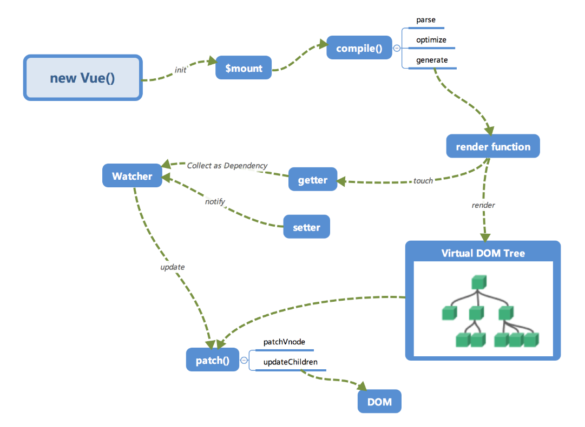
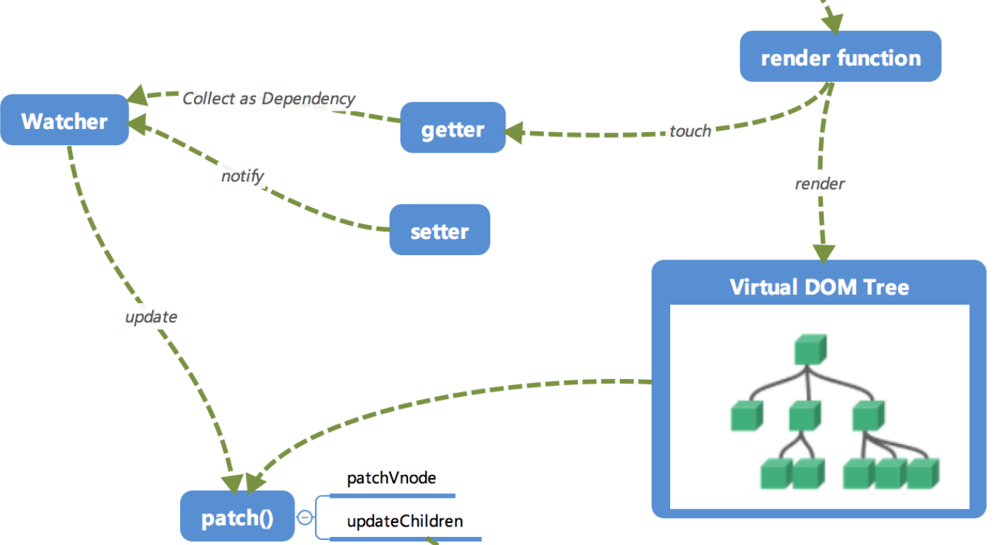
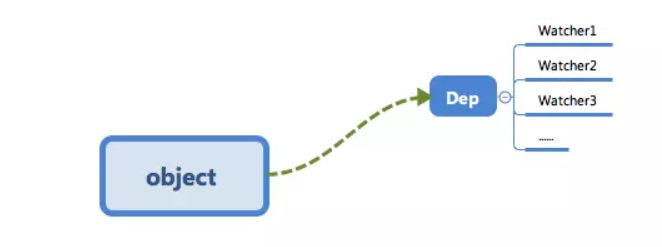

#### 初始化及挂载

在`new Vue()`之后，Vue会调用`_init`函数进行初始化，也就是图片中的`init`过程，它会初始化生命周期、事件、props、methods、data、computed与watch等。其中最重要的是通过`Object.defineProperty`设置`setter`与`getter`函数，用来实现\[响应式]以及\[依赖收集]。

初始化之后调用`$mount`会挂载组件，如果是*运行时编译*,即不存在`render function`但是存在`template`的情况，需要进行[编译]步骤。

#### 编译

`compile`编译可以分为`parse`,`optimize`与`generate`三个阶段，最终需要得到的是`render function`

##### parse

`parse`会用正则表达式解析`template`模版中的指令、class、style等数据，形成AST(抽象语法树)

##### optimize

`optimize`的主要作用是标记static静态节点，这是Vue在编译过程中的一处优化，后面当`update`更新界面时，会有一个`patch`的过程，diff算法会直接跳过静态节点，从而减少了比较的过程，优化了`patch`的性能

##### generate

`generate`是将AST转化为`render function`字符串的过程，得到结果是`render`字符串以及`staticRenderFns`字符串

在经历过`parse`、`optimize`与`generate`这三个阶段以后，组件中就会存在渲染VNode所需的`render function`了

#### 响应式



这里的`getter`与`setter`是在`init`的时候通过`Object.defineProperty`进行了绑定，使得当被设置的对象被读取的时候会执行`getter`函数，而在当被赋值的时候会执行`setter`函数

当`render function`被渲染的时候，因为会读取所需对象的值，所以会触发`getter`函数进行[依赖收集],[依赖收集]的目的是**将观察者Watcher对象存放到当前闭包中的订阅者Dep的subs中**。形成如下的关系：



在修改对象的值的时候，会触发对应的`setter`，`setter`通知之前的[依赖收集]得到的Dep中的每一个Watcher，告诉他们自己的值改变了，需要重新渲染视图。这时候这些Watcher就会调用`update`来更新视图。当然这中间还有一个`patch`的过程以及使用队列异步更新的策略

#### Virtual DOM

`render function`会被转化为VNode节点。Virtual DOM其实就是一颗以javascript对象(VNode节点)作为基础的树，用对象属性来描述节点，实际上它只是一层对真实DOM的抽象。最终可以通过一系列操作是这棵树映射到真实环境中。

```js
{
  tag: 'div',             /*这说明是一个div标签*/
  children: [             /*存放在该标签中的子节点*/
    {       
      tag: 'a',           /*说明这时一个a标签*/
      text: 'click me'    /*标签的内容*/
    }
  ]
}
```

渲染后可以得到：

```js
<div>
  <a>click me</a>
</div>
```

实际上的节点有更多的属性来标志节点，比如 isStatic （代表是否为静态节点）、 isComment （代表是否为注释节点）等。

#### 更新视图

在修改一个对象值的时候，会通过`setter -> Watcher -> update`的流程来修改对应的视图，最终如何更新？

当数据变化后，执行`render function`就可以得到一个新的VNode节点，如果想要得到新的视图，最简单的方法就是直接解析这个新的VNode节点，然后用`innerHTML`直接全部渲染到真实DOM上，但是这样会有浪费，因为只是对其中的一小部分进行了修改

可以通过只修改那些“改变了的地方”。将新的VNode与旧的VNode一起传入`patch`进行比较，经过diff算法得出他们的[差异]，最后只要将这些差异的对应DOM进行修改即可。