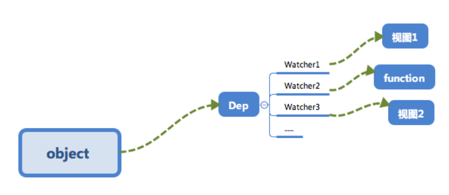
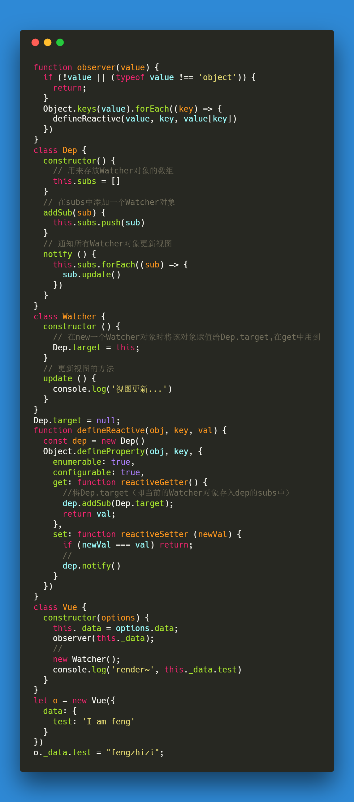

#### 为什么要依赖收集

假设有一个Vue对象：

```js
new Vue({
  template: 
    `<div>
      <span>{{text1}}</span>
      <span>{{text2}}</span>
    </div>`,
  data: {
    text1: 'text1',
    text2: 'text2',
    text3: 'text3'
  }
})
// 然后做了这么一个操作
this.text3 = 'modify text3'
```

修改了`data`中的`text3`数据，但是因为视图中并不需要用到`text3`，并不需要触发所讲的`cb`函数来更新视图，调用`cb`显然是不正确的.

假设现在有一个全局对象，可能会在多个Vue对象中用到它进行展示：

```js
let globalObj = {
  text1: 'text1'
}
let o1 = new Vue({
  template:
    `<div>
      <span>{{text1}}</span> 
    <div>`,
  data: globalObj
})
let o2 = new Vue({
  template:
    `<div>
      <span>{{text1}}</span> 
    <div>`,
  data: globalObj
})
// 执行下面的操作
globalObj.text1 = "fengzhizi";
```

这样应该需要通知`o1`和`o2`两个vm实例进行视图的更新，「依赖收集」会让`text1`这个数据知道“哦～有两个地方依赖我的数据，我变化的时候需要通知它们～”

最终形成数据与视图的一种对应关系：



是如何实现的：

#### 订阅者Dep

实现一个订阅者Dep，它的主要作用是用来存放`Watcher`观察者对象

```js
class Dep {
  constructor() {
    // 用来存放Watcher对象的数组
    this.subs = []
  }
  // 在subs中添加一个Watcher对象
  addSub(sub) {
    this.subs.push(sub)
  }
  // 通知所有Watcher对象更新视图
  notify () {
    this.subs.forEach((sub) => {
      sub.update()
    })
  }
}
```

便于理解只实现了添加的部分代码，主要是两件事情：

1. 用`addSub`方法可以在目前的`Dep`对象中增加一个`Watcher`的订阅操作
2. 用`notify`方法通知目前`Dep`对象的`subs`中的所有`Watcher`对象触发更新操作

#### 观察者Watcher

```js
class Watcher {
  constructor () {
    // 在new一个Watcher对象时将该对象赋值给Dep.target,在get中用到
    Dep.target = this;
  }
  // 更新视图的方法
  update () {
    console.log('视图更新...')
  }
}
Dep.target = null;
```

#### 依赖收集

接下来修改`defineReactive`以及Vue的构造函数，来完成依赖收集

在闭包中增加一个Dep类的对象，用来收集`Watcher`对象。
在对象被读的时候，会触发`reactiveGetter`函数把当前的`Watcher`对象(存放在Dep.target中)收集到`Dep`类中去
之后如果当前对象被写的时候，会触发`reactiveSetter`方法，通知`Dep`类调用`notify`来触发所有的`Watcher`对象的`update`方法更新对应视图

```js
function defineReactive(obj, key, val) {
  const dep = new Dep()
  Object.defineProperty(obj, key, {
    enumerable: true,
    configurable: true,
    get: function reactiveGetter() {
      //将Dep.target（即当前的Watcher对象存入dep的subs中）
      dep.addSub(Dep.target);
      return val;
    },
    set: function reactiveSetter (newVal) {
      if (newVal === val) return;
      // 在set的时候触发dep的notify来通知所有的Watcher对象更新视图
      dep.notify()
    }
  })
}
class Vue {
  constructor(options) {
    this._data = options.data;
    observer(this._data);
    //  新建一个Watcher观察者对象，这时候Dep.target会指向这个Watcher对象
    new Watcher();
    // 在这里模拟render的过程，为了触发test属性的get函数
    console.log('render~', this._data.test)
  }
}
```

完整代码片段：



#### 总结

首先在`observer`的过程中注册一个`get`方法，该方法用来进行“依赖收集”。
在它的闭包中会有一个`Dep`对象，这个对象用来存放Watcher对象的实例。
其实“依赖收集”的过程就是把`Watcher`实例存放到对应的`Dep`中。
`get`方法可以让当前的`Watcher`对象(Dep.target)存放到它的`subs`中(`addSub`)方法，
在数据变化时，`set`会调用`Dep`对象的`notify`方法通知它内部所有的`Watcher`对象进行视图更新。

这是`Object.defineProperty`的`set/get`方法处理的事情，“依赖收集”的前提条件还有两个：
1. 触发`get`方法
2. 新建一个Watcher对象

这个在Vue的构造类中处理，新建一个`Watcher`对象只需要new出来，这时候`Dep.target`已经指向了这个new出来的`Watcher`对象。
而触发`get`方法也简单，实际上只要把`render function`进行渲染，那么其中的依赖的对象都会被“读取”，这里通过打印来模拟这个过程，读取test来触发`get`进行依赖收集

